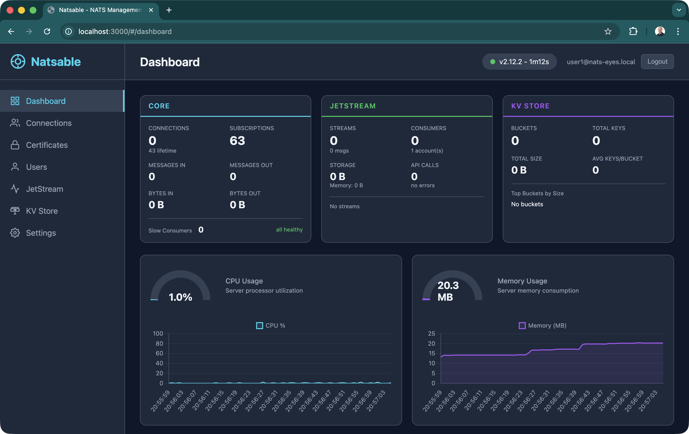
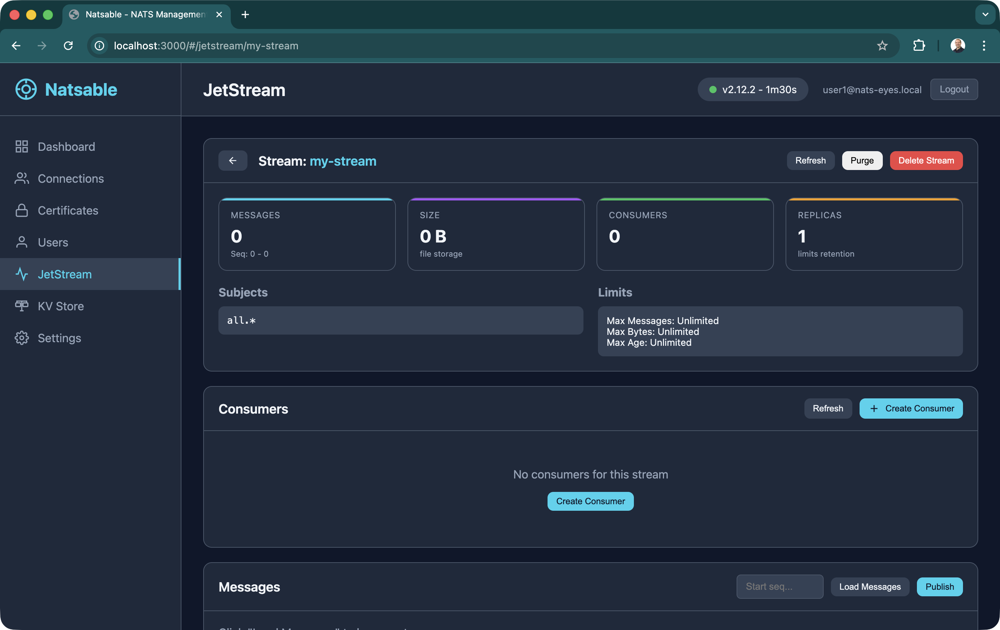
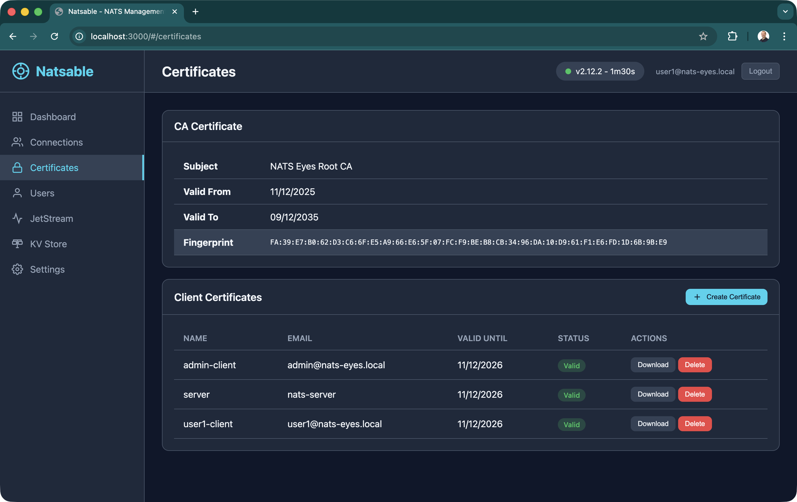
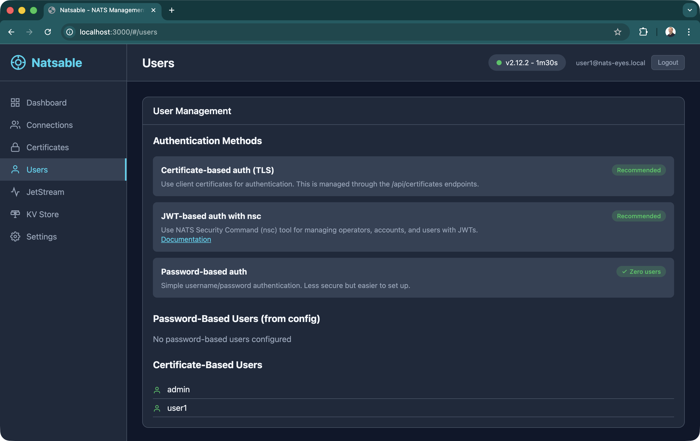

# natsable

A web-based GUI and management application for [NATS.io](https://nats.io/) messaging system. Monitor your NATS server, manage JetStream streams and consumers, browse Key-Value stores, and handle certificate-based authentication.

## Features

- **Dashboard & Monitoring** - Real-time server statistics, connection tracking, 24-hour historical data
- **JetStream Administration** - Create, browse, and manage streams and consumers
- **Key-Value Store Browser** - Full CRUD operations on KV buckets with real-time watching
- **Certificate Management** - Generate, view, and manage TLS client certificates
- **User Management** - View password and certificate-based users from NATS config

## Screenshots

<table>
  <tr>
    <td></td>
    <td></td>
  </tr>
  <tr>
    <td></td>
    <td></td>
  </tr>
</table>

## Prerequisites

- Node.js 24+
- Docker (for running NATS server)
- OpenSSL (for certificate generation)

## Quick Start

### Using Docker (Recommended)

```bash
# Generate TLS certificates
npm run generate-certs

# Start the full stack (NATS + natsable)
docker compose up -d
```

Access the web UI at `http://localhost:3000`

### Local Development

```bash
# Install dependencies
npm install

# Generate TLS certificates
npm run generate-certs

# Start NATS server only
npm run docker:up

# Run the application in dev mode
npm run dev
```

## Scripts

| Command | Description |
|---------|-------------|
| `npm start` | Start the server |
| `npm run dev` | Start development server with auto-reload |
| `npm run demo` | Run demo mode with sample data generation |
| `npm run generate-certs` | Generate TLS certificates |
| `npm run docker:up` | Start NATS server in Docker |
| `npm run docker:down` | Stop NATS server |
| `npm run docker:logs` | View NATS server logs |

## Configuration

### Environment Variables

| Variable | Default | Description |
|----------|---------|-------------|
| `PORT` | `3000` | HTTP server port |
| `NATS_URL` | `localhost:4223` | NATS server address |
| `NATS_MONITORING_URL` | `http://localhost:8223` | NATS HTTP monitoring endpoint |
| `CERTS_DIR` | `./certs` | TLS certificates directory |
| `CONFIG_DIR` | `./config` | NATS configuration directory |
| `NODE_ENV` | `development` | Environment mode |

## API Endpoints

### Authentication
- `POST /api/auth/login` - Login with client certificate
- `POST /api/auth/logout` - End session
- `GET /api/auth/session` - Check session status

### NATS Monitoring
- `GET /api/nats/status` - Combined server status
- `GET /api/nats/varz` - Server variables
- `GET /api/nats/connz` - Connection information
- `GET /api/stats/history` - 24-hour historical stats

### JetStream
- `GET /api/jetstream/streams` - List streams
- `POST /api/jetstream/streams` - Create stream
- `GET /api/jetstream/streams/:name` - Stream details
- `GET /api/jetstream/streams/:name/messages` - Browse messages
- `POST /api/jetstream/streams/:name/publish` - Publish message
- `DELETE /api/jetstream/streams/:name` - Delete stream

### Key-Value Store
- `GET /api/kv/buckets` - List buckets
- `POST /api/kv/buckets` - Create bucket
- `GET /api/kv/buckets/:name/keys` - List keys
- `GET /api/kv/buckets/:name/keys/:key` - Get value
- `PUT /api/kv/buckets/:name/keys/:key` - Set value
- `DELETE /api/kv/buckets/:name/keys/:key` - Delete key
- `GET /api/kv/buckets/:name/watch` - Watch for changes (SSE)

### Certificates
- `GET /api/certificates` - List certificates
- `POST /api/certificates` - Create certificate
- `GET /api/certificates/:name/download` - Download certificate bundle
- `DELETE /api/certificates/:name` - Delete certificate

## Docker Deployment

```bash
# Start full stack (NATS server + natsable)
docker compose up -d

# View logs
docker compose logs -f

# Stop services
docker compose down

# Rebuild after code changes
docker compose up -d --build
```

### Services

| Service | Port | Description |
|---------|------|-------------|
| `nats` | 4223 | NATS server (client connections) |
| `nats` | 8223 | NATS HTTP monitoring |
| `natsable` | 3000 | Web UI |

### Optional Services

```bash
# Start with NATS CLI tools (nats-box)
docker compose --profile tools up -d

# Start with Prometheus metrics (nats-surveyor)
docker compose --profile monitoring up -d
```

## Project Structure

```
├── src/
│   ├── server.ts           # Express server & routing
│   ├── demo.ts             # Demo data generator
│   ├── statsCollector.ts   # Historical stats collection
│   ├── routes/             # API route handlers
│   └── middleware/         # Auth middleware
├── config/                 # NATS server configurations
├── scripts/                # Utility scripts
├── certs/                  # TLS certificates (generated)
├── Dockerfile              # Container image definition
└── docker-compose.yml      # Multi-service orchestration
```

## License

MIT
